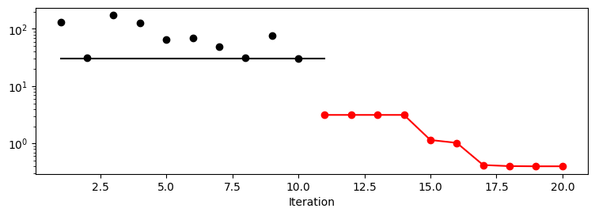
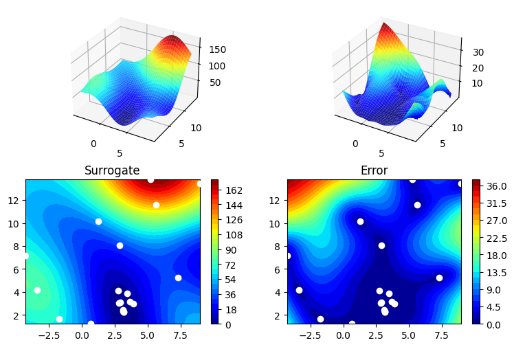

# SPOT Examples

## Simple spotPython run

```{python}
import numpy as np
from spotPython.spot import spot
from spotPython.fun.objectivefunctions import analytical
from spotPython.utils.init import fun_control_init, design_control_init, surrogate_control_init

fun = analytical().fun_branin
fun_control = fun_control_init(lower = np.array([-5, 0]),
                               upper = np.array([10, 15]),
                               fun_evals=20)
design_control = design_control_init(init_size=10)
surrogate_control = surrogate_control_init(n_theta=2)
S = spot.Spot(fun=fun, fun_control=fun_control, design_control=design_control)
S.run()
```

```raw
spotPython tuning: 3.146824136952164 [######----] 55.00% 
spotPython tuning: 3.146824136952164 [######----] 60.00% 
spotPython tuning: 3.146824136952164 [######----] 65.00% 
spotPython tuning: 3.146824136952164 [#######---] 70.00% 
spotPython tuning: 1.1487233101571483 [########--] 75.00% 
spotPython tuning: 1.0236891516766402 [########--] 80.00% 
spotPython tuning: 0.41994270072214057 [########--] 85.00% 
spotPython tuning: 0.40193544341108023 [#########-] 90.00% 
spotPython tuning: 0.3991519598268951 [##########] 95.00% 
spotPython tuning: 0.3991519598268951 [##########] 100.00% Done...
```


```python
S.print_results()
```

```raw
min y: 0.3991519598268951
x0: 3.1546575195040987
x1: 2.285931113926263
```


```{python}
S.plot_progress(log_y=True)
```




```{python}
S.surrogate.plot()
```




## Further Examples

Examples can be found in the Hyperparameter Tuning Cookbook, e.g., [Documentation of the Sequential Parameter Optimization](https://sequential-parameter-optimization.github.io/Hyperparameter-Tuning-Cookbook/a_04_spot_doc.html).